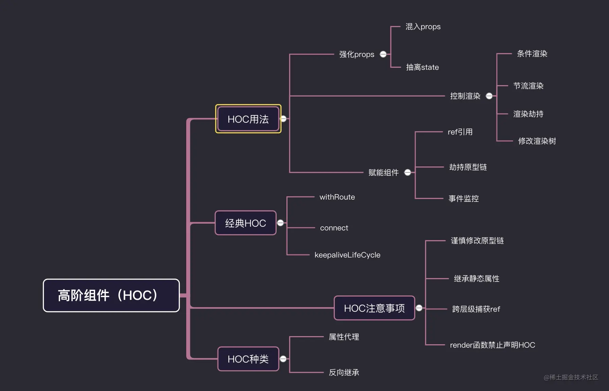
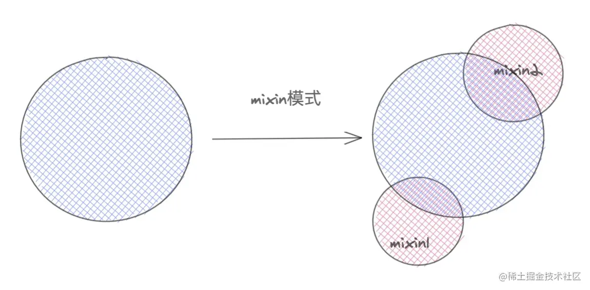
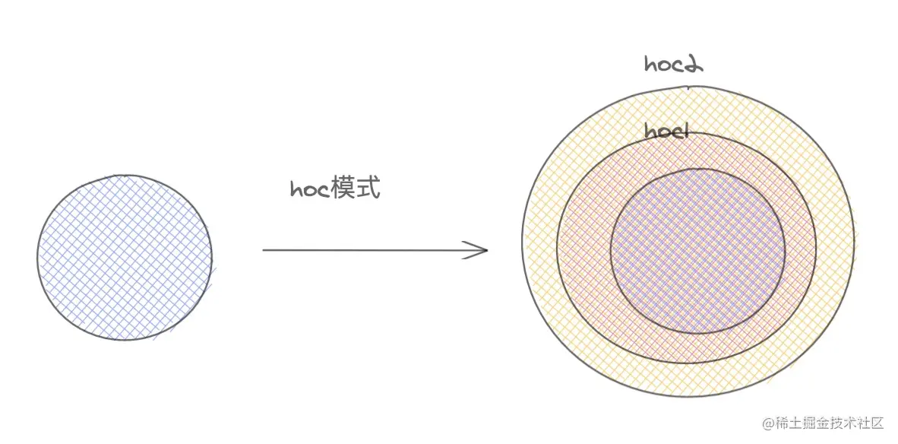

### 高阶组件

> 高阶组件（HOC）是React中用于复用组件逻辑的一种高级技巧。HOC自身不是React API的一部分，它是基于React的组合特性而形成的设计模式。

+ 包装强化组件的方式

> mixin 模式
> 原型图
> 

> HOC 模式

+ 组件是把prop渲染成UI,而高阶组件是将组件转换成另外一个组件

> 复用逻辑：高阶组件像是一个react组件工厂，批量对原有组件进行加工，包装处理。根据业务定制专属化HOC,可解决复用逻辑。
> 强化props：HOC最常用方法之一，高阶组件返回的组件，可以劫持上层传过来的props，然后混入新的props，来增强组件功能，代表react-router中的widthRouter
> 赋能组件：HOC为组件提供额外的拓展功能，比如额外的生命周期，额外的事件，但是这种HOC，可能需要与业务组件紧密结合，典型案例react-keepalive-router中的keepaliveLifeCycle。
> 控制渲染：劫持渲染是HOC一个特性，在wrapComponent包装组件中，可以对原来的组件进行条件渲染，节流渲染，懒加载等。典型代表react-redux中的connect和dva中的dynamic组件懒加载

+ 正向属性代理
+ 用组件包裹一层代理组件，在代理组件可对源组件做一些代理操作。可理解为父子组件关系

>优点

1. 正常属性代理可以和业务组件低耦合，零藕合，对于条件渲染和props属性增强，只负责控制子组件渲染和传递额外的props就可。
2. 同样适用class和function组价。
3. 可完全隔离业务组件的渲染，相比反向继承，属性代理这种模式。可以完全控制业务组件渲染与否，可避免反向继承带来的副作用，比如生命周期的执行。
4. 可以嵌套使用，多个HOC可以嵌套，一般不会限制HOC包装的先后顺序

>缺点

1. 一般无法直接获取业务组件的状态，想要获取需要ref获取组件实例。
2. 无法继承静态属性，需要手动处理或引入第三方库。

+ 反向继承
+ 反向继承和属性代理有区别，包装过的组件继承了业务组件本身。故无需实例化业务组件，当前高阶组件就是继承后，加强型的业务组件

> 优点
> 
1. 方便获取组件内部状态，如state，props，生命周期，绑定的事件函数等。
2. es6继承可以良好的继承静态属性，无需对静态属性和方法进行额外的处理。

> 缺点 

1. 无状态组件无法使用。
2. 被包装的组件强耦合，需要知道被包装的组件内部状态，具体做什么？
3. 多个HOC嵌套，后面的会覆盖前面的。